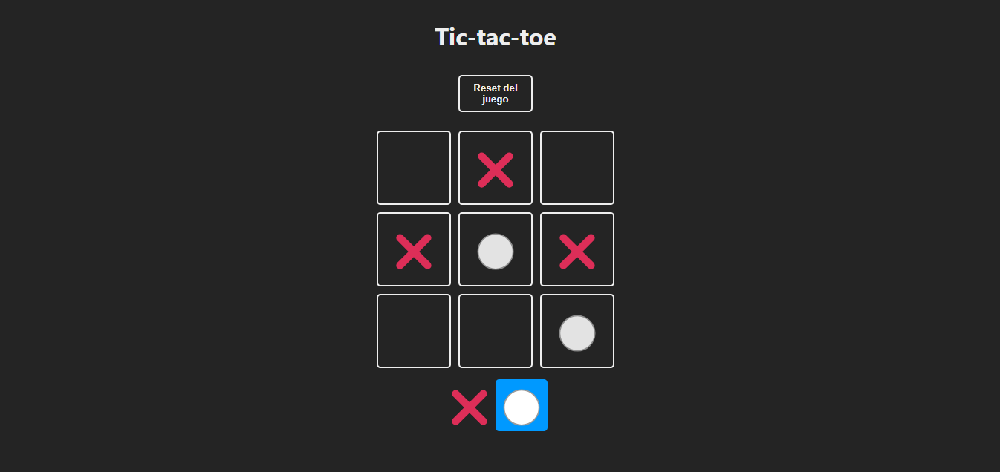
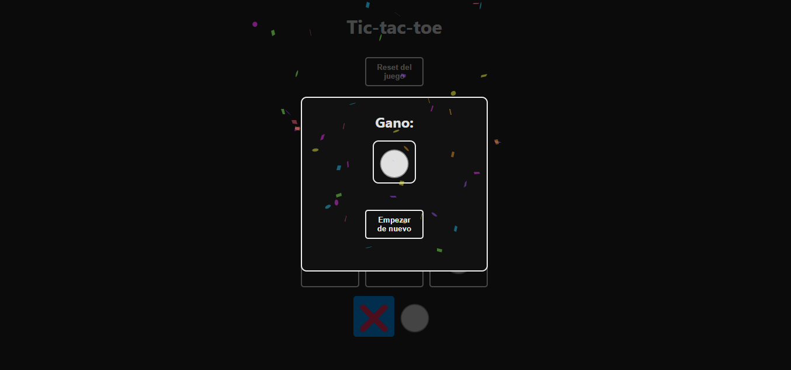

# Tic-tac-toe

## Project Create With React + Vite

This template provides a minimal setup to get React working in Vite with HMR and some ESLint rules.

## Description

This implementation of the classic Tic-Tac-Toe game has been developed using ReactJS. It offers a complete gaming experience with basic game functionality, allowing players to compete to check three consecutive boxes. Additionally, it has an additional feature that makes use of the Canvas Confetti library, adding a confetti effect at the end of the game when a player wins. Game progress is saved locally using Local Storage so players can resume previous games. The design has been created with CSS3 and advanced React concepts have been implemented, including the use of reusable components.

## Characteristics

* Implementation of the classic Tic-Tac-Toe game with full functionality.
* Confetti visual effect upon winning, thanks to Canvas Confetti.
* Saving game progress to Local Storage to continue previous games.
* Styled using CSS3 with a focus on usability.
* Use of advanced React concepts and reusable components.

## Screenshots




## Install

Clone this repository:

```bash
git clone https://github.com/Chencho34/tic-tac-toe
```

Install the dependencies:

```bash
npm install
```

## Execute Project

```bash
npm run dev
```

Runs the app in the development mode.
Open [http://localhost](http://localhost) to view it in your browser.

The page will reload when you make changes.
You may also see any lint errors in the console.

## Author

Developer: Chencho34

## Implemented technologies.

* [Confetti Canvas](https://styled-components.com/)
* [React + vite](https://vitejs.dev/)
* [Canvas Confetti](https://www.npmjs.com/package/canvas-confetti)
* Local Storage: Almacenamiento del progreso del juego.
* CSS3: Estilización y diseño del juego.
